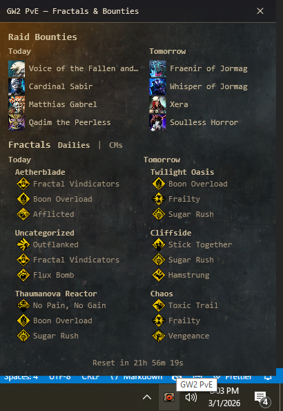

# GW2 PvE Desktop

A Windows system-tray app for **Guild Wars 2** that shows daily **Raid Bounties** and **Fractals** (T4 dailies and Challenge Motes) with a Guild Wars–style popup.

## Example



## Features

- **Raid Bounties** — Today and tomorrow’s bounty bosses with icons
- **Fractals** — Toggle between:
  - **Dailies** — Tier 4 fractals for today and tomorrow with instabilities
  - **CMs** — Challenge Mote fractals (scales 95–100) with current instabilities in two columns
- **Reset countdown** — Time until daily reset at the bottom of the popup
- **System tray** — Runs in the tray; left-click or “Show” to open the popup (opens automatically on startup after data loads)
- **Guild Wars–style UI** — Wispy transparent-edged background (asset 1909321), Menomonia font, and cream/gold palette

## Requirements

- **Windows** (x64)
- [.NET 8 Desktop Runtime](https://dotnet.microsoft.com/download/dotnet/8.0) (if not using a self-contained build)

## Download

Pre-built releases are available on the [Releases](https://github.com/a727891/gw2_pve_desktop/releases) page:

1. Open the [Releases](https://github.com/a727891/gw2_pve_desktop/releases) page.
2. Choose the latest release (or a specific version).
3. Under **Assets**, download the Windows build (e.g. `Gw2PveDesktop.exe` or a zip containing it).
4. Run the executable (unzip first if you downloaded an archive).

## Build

```bash
cd Gw2PveDesktop
dotnet build
```

**Release (single-file exe):**

```bash
dotnet publish -c Release
```

Output: `Gw2PveDesktop/bin/Release/net8.0-windows/win-x64/Gw2PveDesktop.exe`

## Run

- Run the exe; it will appear in the system tray.
- The popup opens automatically after the first successful data load.
- **Tray left-click** or **Show** in the context menu — open or focus the popup.
- **Refresh** — reload schedule data from the API.
- **Exit** — quit the app.

## Data source

Schedule data (fractal maps, instabilities, daily bounties, raid/strike info) is loaded from a static JSON API (same source as [BlishHud Raid Clears](https://github.com/a727891/BlishHud-Raid-Clears)). Icons are fetched from [gw2dat.com](https://assets.gw2dat.com/) and cached locally.

## Project structure

```
Gw2PveDesktop/
  App.xaml.cs           # Startup, tray icon, popup show/refresh
  PopupWindow.xaml      # Main popup UI (bounties, fractals, reset)
  PopupWindow.xaml.cs   # Data binding, Dailies/CMs toggle, background
  Services/
    ScheduleService.cs  # Builds schedule (bounties, fractals, CMs)
    DataService.cs      # HTTP client for JSON APIs
    BountyIconCacheService.cs
  Models/               # JSON DTOs (fractal_maps, instabilities, etc.)
  Assets/               # Menomonia font, app icon
```

## License

See repository for license information.
